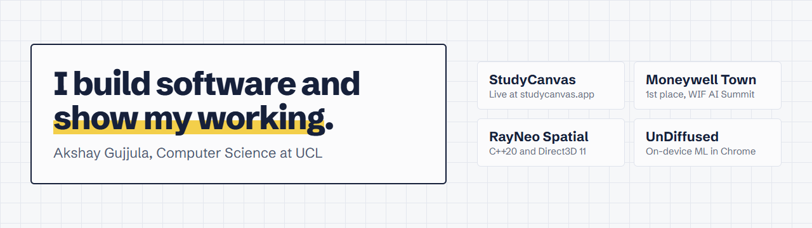
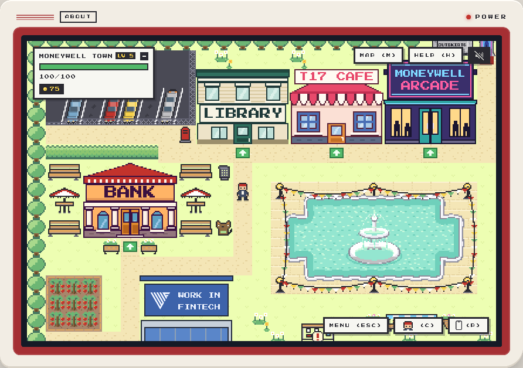

<a href="https://akshaygujjula.com">
  <picture>
    <source media="(prefers-color-scheme: dark)" srcset="docs/readme/banner-dark.png">
    
  </picture>
</a>

I'm a second-year Computer Science student at UCL. I build full-stack, AI and performance-sensitive systems, and I like getting them in front of real people: ten students use StudyCanvas every week, and Moneywell Town won the Work in Fintech AI Summit hackathon.

[](https://akshaygujjula.com) [](https://www.linkedin.com/in/akshayreddygujjula/) [](mailto:akshayreddyg07@gmail.com)

## Featured

<table>
  <tr>
    <td width="50%" valign="top">
      <a href="https://moneywelltown.com"></a>
      <h3><a href="https://moneywelltown.com">Moneywell Town</a></h3>
      <p>A browser game that teaches UK teenagers how money works, from interest and tax to credit and scams. Built in a week, it won first place at the Work in Fintech AI Summit and is heading to Web Summit Lisbon.</p>
      <p><sub>React, TypeScript, Vite. A five-box spaced-repetition engine and a custom tile renderer.</sub></p>
    </td>
    <td width="50%" valign="top">
      <a href="https://studycanvas.app"></a>
      <h3><a href="https://studycanvas.app">StudyCanvas</a></h3>
      <p>A spatial AI study workspace. Highlight a passage in a PDF, ask about it, and the answer streams into a node you can branch, quiz yourself on or turn into flashcards.</p>
      <p><sub>React, React Flow, FastAPI, Gemini. <a href="https://github.com/AkshayReddyGujjula/StudyCanvas-Public">Read the engineering record</a>.</sub></p>
    </td>
  </tr>
  <tr>
    <td width="50%" valign="top">
      <h3><a href="https://github.com/AkshayReddyGujjula/UnDiffused-AI">UnDiffused</a></h3>
      <p>A Chrome extension that estimates whether an image is AI-generated, entirely on-device. 0.954 AUROC on 400 unseen content-matched pairs.</p>
      <p><sub>DINOv2, ONNX Runtime Web, WebAssembly.</sub></p>
    </td>
    <td width="50%" valign="top">
      <h3><a href="https://github.com/AkshayReddyGujjula/Rayneo-Spatial-App">RayNeo Spatial</a></h3>
      <p>A head-tracked Windows desktop for RayNeo GT glasses. Real Windows monitors float around you and stay put as you turn your head.</p>
      <p><sub>C++20, Direct3D 11, IMU sensor fusion.</sub></p>
    </td>
  </tr>
</table>

Hackathons: 1st at the UCL Data Science Society Finance Track, 5th of 100+ at the Imperial × Anthropic Claude Hackathon, and one of 6 projects from 50+ presented on stage at the London A2A and A2UI Hackathon. [The full list is on my site](https://akshaygujjula.com/#hackathons).

## Stack

     

       

     

## This repository

Besides this profile, the repository is the source of [akshaygujjula.com](https://akshaygujjula.com): Astro 7 with React islands, served from Cloudflare Workers.

[](https://github.com/AkshayReddyGujjula/AkshayReddyGujjula/actions/workflows/ci.yml)

```bash
npm install
npm run dev        # http://localhost:4321
npm test           # unit tests, including a WCAG contrast check on the colour tokens
npm run test:e2e   # Playwright against the production build in the Workers runtime
```

Why it's built this way is in [ADR-0001](docs/adr/0001-site-architecture.md), and shipping it is in [the deployment runbook](docs/deployment.md).
